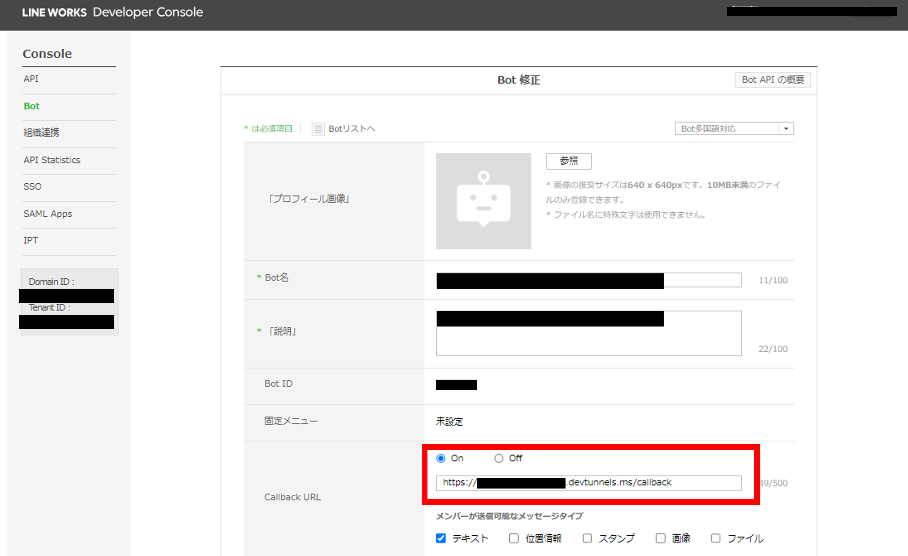
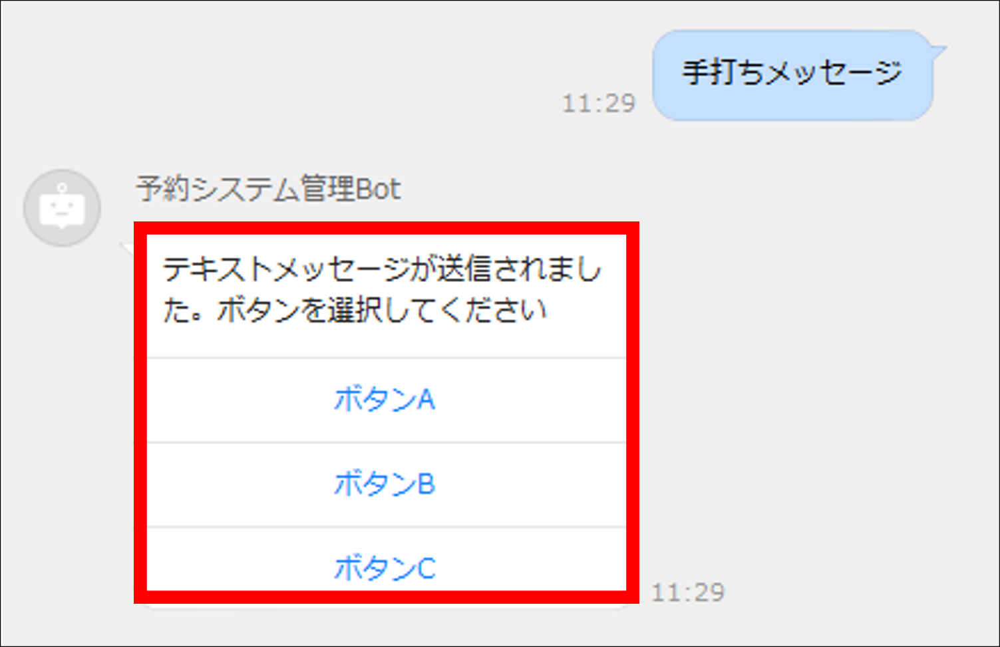

# LINE WORKS API応用 サンプルコード

## 目次 <!-- omit in toc -->

- [概要](#概要)
- [使用方法](#使用方法)
  - [前提条件](#前提条件)
  - [事前準備](#事前準備)
  - [サンプルプロジェクトのクローン](#サンプルプロジェクトのクローン)
  - [アプリケーション起動](#アプリケーション起動)
  - [アプリケーション起動後設定](#アプリケーション起動後設定)
    - [ポート転送設定](#ポート転送設定)
    - [Callback URL設定](#callback-url設定)
  - [動作確認方法](#動作確認方法)
- [付録](#付録)
- [問合せ先](#問合せ先)

## 概要

LINE WORKS APIとBotを利用したサンプルコードです。Callbackに含まれるポストバックの値に応じて、送信するメッセージ種類の分岐を行います。

本サンプルコードで使用しているメッセージは、次の4種類です。

- テキストメッセージ
- リンクメッセージ
- ボタンテンプレート
- カルーセルテンプレート

その他のメッセージの種類については、次の公式ドキュメントを参照してください。

メッセージタイプ：<https://developers.worksmobile.com/jp/docs/bot-send-content>

## 使用方法

### 前提条件

- Visual Studio Code（バージョン1.82以上）がインストール済み
- Gradleがインストール済み
- Java SE 17（LTS）がインストール済み
- GitHubのアカウントを作成済み
- Gitがインストール済み

各種のインストール方法は省略します。

### 事前準備

- LINE WORKSのアカウントを新規開設

アカウント新規作成：<https://join.worksmobile.com/jp/joinup/step1>

- Developer Consoleから`Bot`と`アプリ`を新規作成

Developer Console：<https://dev.worksmobile.com/jp/console/openapi/v2/app/list/view>

- 本プロジェクト内の[application.properties](./src/main/resources/application.properties)で設定している環境変数の値を更新（値はすべてDeveloper Consoleから取得できます）

### サンプルプロジェクトのクローン

コマンドライン実行画面から、次のコマンドを実行してください。

```shell
git clone https://github.com/solxyz-jsn/lineworks-sample-advanced
```

### アプリケーション起動

Visual Studio Codeでフォルダ`lineworks-sample-advanced`を開いてください。

左メニューの`JAVA PROJECT`から、プロジェクト`lineworks-sample-advanced`を右クリックして`Run`を選択してください。


（画像のVisual Studio Codeはバージョン1.83です）

補足として、Visual Studio Code上でターミナルを開いていれば、ターミナルから次のコマンドを実行しても起動できます。

```shell
./gradlew bootRun
```

### アプリケーション起動後設定

起動後に行う設定の詳細は、コース「LINE WORKS API応用」でも説明を記載しています。詳細はそちらを参照してください。

#### ポート転送設定

LINE WORKSからのHTTPS POSTリクエストを受信するために、ポート転送の設定を行う必要があります。この手順には、**GitHubのアカウントが必須**となります。

Visual Studio Code上でターミナルを開いてください。

タブ`ポート`を押下して、`ポートの転送`を押下してください。ポート入力欄には、[application.properties](./src/main/resources/application.properties)の`server.port`で設定しているポート番号（デフォルトでは`8080`）を入力してください。


初めてポート転送設定を行う場合は、GitHubアカウントによるサインインを確認するポップアップが表示されるので、`許可`を押下してGitHubアカウントのサインインを行ってください。


しばらく待機すると、URLが発行されます。

次に、LINE WORKSからの通信を許可するために、表示範囲を変更します。右クリックから`ポートの表示範囲`を`公開`に設定してください。


#### Callback URL設定

LINE WORKSがCallbackをアプリケーションへ送信できるように、Developer ConsoleのBot画面からCallbackの送信先URL（以降、Callback URL）を設定します。

Developer Console Bot画面：<https://dev.worksmobile.com/jp/console/bot/view>

Callback URL入力欄には、次の値を入力してください。

```txt
{Visual Studio Codeで発行したアドレス} + callback
```

入力例は次のようになります。



### 動作確認方法

LINE WORKSから実際にメッセージを送信して動作確認を行います。Webブラウザ、Webアプリ、モバイルアプリいずれでも問題ありません。

Botとのトークルームからメッセージを送信すると、ポストバックの値に応じたメッセージを返します。




## 付録

コース「LINE WORKS API応用」のリッチメニュー登録時に使用するJSONのサンプルがあります。

richmenu_json_sample.jsonを参照してください。

## 問合せ先

`jsn-support@solxyz.co.jp`までお問合せください。
