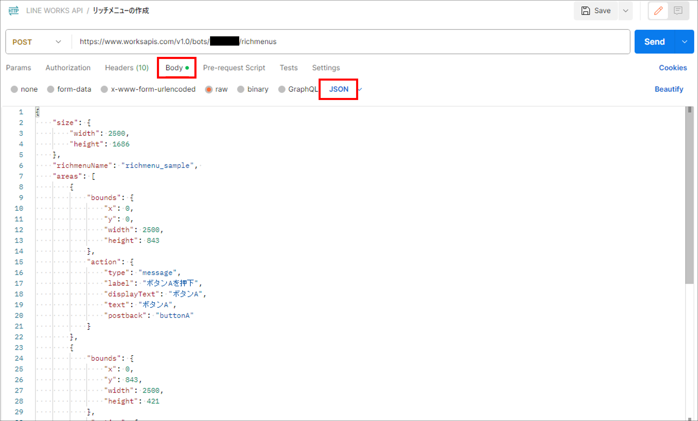

# リッチメニュー定義サンプル <!-- omit in toc -->

## 目次 <!-- omit in toc -->

- [概要](#概要)
- [該当ファイル](#該当ファイル)
- [該当コース](#該当コース)
- [使用方法](#使用方法)

## 概要

コース「LINE WORKS API応用」でリッチメニュー定義のサンプルとして紹介しているJSONです。

## 該当ファイル

[richmenu_json_sample.json](./richmenu_json_sample.json)

## 該当コース

[SOLXYZ Academy](https://academy.solxyz.co.jp)内コース「LINE WORKS API応用」より、「ステップ4：リッチメニューの定義」を参照してください。

## 使用方法

[richmenu_json_sample.json](./richmenu_json_sample.json)内の本文をコピーして、送信するリクエストのボディ部にJSON形式で貼り付けてください。

リクエストの送信には、Postmanを使用してください。
